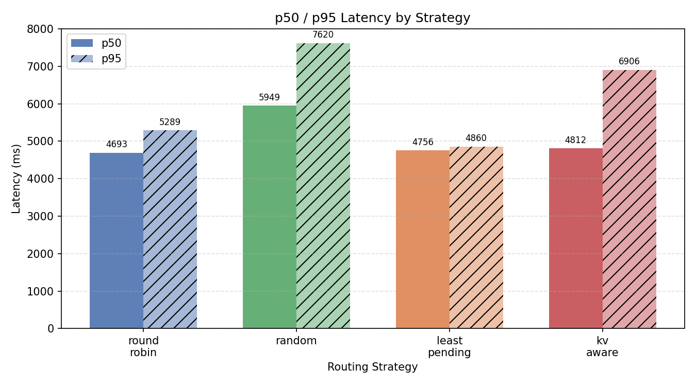
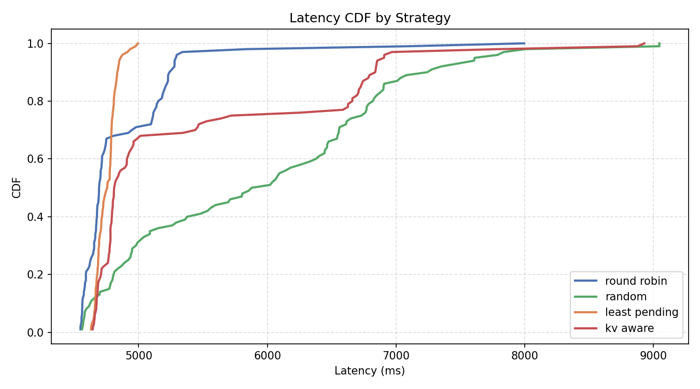
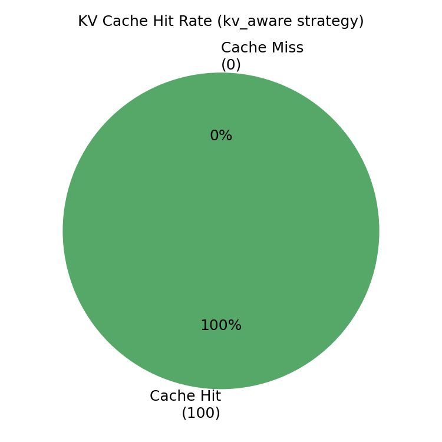
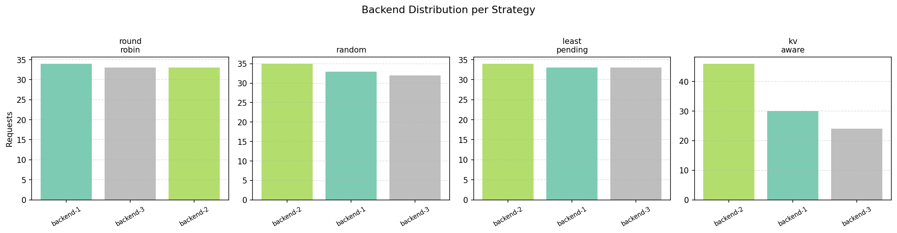
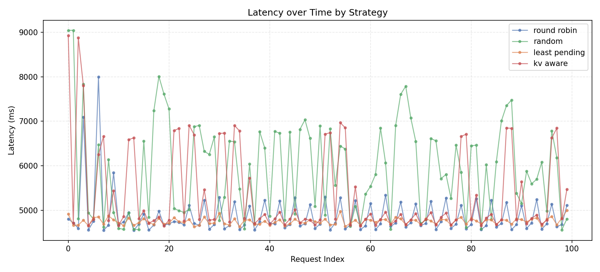

# InferFlow

InferFlow is a scalable LLM inference router centered on a Go control-plane and pluggable routing strategies. It runs on AWS EKS with three llama.cpp backends (Qwen2.5-0.5B-Instruct, CPU-only) and supports four routing strategies switchable at runtime — with a Streamlit dashboard for live monitoring.

## Why We Built This

Serving LLMs at scale is expensive and latency-sensitive. A single model server becomes a bottleneck the moment you add concurrency, and naive round-robin routing wastes money by ignoring KV-cache state and backend load. We wanted to explore whether smarter routing — cache-affinity routing, cost-aware selection, least-pending dispatch — could meaningfully reduce p95 latency and error rates compared to the baseline.

InferFlow is our answer: a thin, observable Go router sitting in front of multiple inference workers, making routing decisions in microseconds based on live backend state and prompt-level cache affinity. We built it to run real benchmarks and measure the tradeoffs between routing strategies under load.

---

## Architecture

```
┌─────────────────────────────────────────────────────────────┐
│  Load Generator (Python)  /  Streamlit UI  /  curl          │
└─────────────────────────────┬───────────────────────────────┘
                              │  OpenAI-compatible HTTP
                              ▼
              ┌───────────────────────────────┐
              │         Go Router             │
              │  POST /v1/chat/completions    │
              │  GET|PUT /strategy            │
              │  GET /metrics  GET /readyz    │
              └──────────────┬────────────────┘
                             │
              ┌──────────────┼──────────────┐
              │              │              │
       round_robin     least_pending    kv_aware ◄── Redis
         random          cost_aware              (affinity cache)
              │              │              │
              └──────────────┼──────────────┘
                             │
          ┌──────────────────┼──────────────────┐
          ▼                  ▼                  ▼
    ┌──────────┐       ┌──────────┐       ┌──────────┐
    │ worker-0 │       │ worker-1 │       │ worker-2 │
    │ :9000    │       │ :9000    │       │ :9000    │
    └──────────┘       └──────────┘       └──────────┘
     (llama.cpp + Qwen2.5-0.5B-Instruct, EKS c5.xlarge nodes)
```

**Stack:**
- Router — Go 1.21, `net/http`, zero external dependencies
- Backends — llama.cpp serving Qwen/Qwen2.5-0.5B-Instruct-GGUF behind a vLLM-adapter sidecar
- Cache — Redis (EKS) or in-process TTL store (local)
- Infra — AWS EKS (us-east-1), Terraform, GitHub Actions CI
- Observability — Prometheus metrics, OpenTelemetry scaffolding
- UI — Streamlit dashboard (`ui/app.py`)

---

## Routing Strategies

| Strategy | Algorithm | When to Use |
|----------|-----------|-------------|
| `round_robin` | Atomic counter cycling across healthy backends | Baseline / simplest fair distribution |
| `least_pending` | Routes to backend with fewest in-flight requests | General load balancing |
| `random` | Uniform random selection over healthy backends | Stateless, avoids thundering-herd |
| `kv_aware` | SHA256 key of model+prompt → Redis lookup → prefer warm-cache backend, fall back to least_pending | Repeated prompts, reduces recompute latency |
| `cost_aware` | Tracks estimated token cost per backend, routes to lowest-cost | Optimise total cost, not just queue depth |

Switch strategies at runtime without restarting:

```bash
curl -X PUT http://localhost:8080/strategy \
  -H "Content-Type: application/json" \
  -d '{"strategy": "kv_aware"}'
```

---

## Documentation

Detailed documentation is organized under [docs/README.md](docs/README.md).

Quick links:

- [Overview](docs/overview.md)
- [Local Development](docs/local-development.md)
- [EKS vLLM Deployment](docs/eks-vllm.md)
- [Triton Setup](docs/triton-setup.md)
- [Kubernetes Deployment](docs/kubernetes-deployment.md)
- [Terraform Infrastructure](docs/terraform-infrastructure.md)
- [GitHub Actions](docs/github-actions.md)
- [Destroy Workflow](docs/destroy-workflow.md)

---

## Load Test Results

Load tests were run against a live AWS EKS cluster (3x c5.xlarge nodes, llama.cpp + Qwen2.5-0.5B-Instruct).

### Strategy Comparison — 100 requests each, 3 concurrent, mixed prompts

| Strategy | p50 (ms) | p95 (ms) | min (ms) | max (ms) |
|---|---|---|---|---|
| round_robin | 4693 | 5296 | 4548 | 7995 |
| **least_pending** | **4757** | **4860** | 4630 | **4995** |
| kv_aware | 4812 | 6906 | 4642 | 8930 |
| random | 5949 | 7789 | 4560 | 9046 |

- `least_pending` wins at scale — tightest p95 (4860ms) and lowest max (4995ms). At 3 concurrent requests across 3 backends it actively avoids overloading a single backend.
- `round_robin` is a close second on p50 but shows higher tail latency (max 7995ms) when backends fall behind.
- `random` is clearly the worst — p50 nearly 1.3s slower than round_robin, max latency over 9 seconds due to random backend collisions.
- `kv_aware` achieves 100/100 Redis cache hits but shows high tail latency (p95 6906ms) because it concentrates repeated prompts on one backend (backend-2 got 46% of traffic), creating a hotspot.

### KV Cache Benefit — repeated long prompt, concurrency 1

This test sent the same 200-token prompt on every other request (`--repeat-factor 2`) and compared `round_robin` vs `kv_aware`.

| Strategy | Repeated prompt avg | Unique prompt avg |
|---|---|---|
| round_robin | 6042ms | 4657ms |
| **kv_aware** | **4708ms** | — |

`round_robin` distributes repeated prompts across all three backends, so each backend recomputes the KV attention from scratch — spiking to 6962ms in the worst case.

`kv_aware` pins each prompt hash to one backend via Redis. That backend already has the KV cache warm from the previous request, so repeated prompts complete as fast as unique ones (4708ms avg vs 4657ms for fresh prompts on round_robin).

### Response Headers

Every response includes:

- `X-Inferflow-Backend` — which backend handled the request (`backend-1`, `backend-2`, `backend-3`)
- `X-Inferflow-Strategy` — active routing strategy
- `X-Inferflow-Cache-Hit` — `true`/`false` (kv_aware only) — whether Redis returned a cached backend for this prompt

### Charts

Generated by `python analysis/charts.py --input results/loadtest.csv --output results/`:

**p50 / p95 Latency by Strategy**


**Latency CDF by Strategy**


**KV Cache Hit Rate (kv_aware only)**


**Backend Distribution per Strategy**


**Latency over Time**


---

## Current MVP Status

Implemented:

- Go router with `POST /v1/chat/completions`
- runtime routing strategies: `round_robin`, `least_pending`, `random`, `kv_aware`
- strategy switching through `GET/PUT /strategy`
- metrics endpoint at `GET /metrics`
- mock-backed local development flow
- llama.cpp adapter plus EKS deployment assets
- Redis-backed prompt affinity for kv_aware strategy
- Streamlit dashboard for live monitoring and strategy switching
- retained Triton code as a deferred backend path

Planned next:

- Streaming SSE responses
- Kubernetes endpoint discovery
- richer Prometheus/Grafana dashboards
- KEDA autoscaling rollout

---

## Local Quick Start

### Option 1: Native processes

```bash
# Terminal 1 — mock backend
go run ./cmd/mock-backend

# Terminal 2 — router
export INFERFLOW_BACKENDS="http://localhost:9000"
go run ./cmd/router
```

Send a sample request:

```bash
curl -X POST http://localhost:8080/v1/chat/completions \
  -H "Content-Type: application/json" \
  -d '{"model":"mock-llm","messages":[{"role":"user","content":"Hello from InferFlow"}]}'
```

Run tests:

```bash
go test ./...
```

Run all strategies locally:

```bash
python loadgen/generator.py --requests 5 --strategies round_robin,least_pending,random,kv_aware --output results/strategies.csv
```

### Option 2: Docker Compose

```bash
docker compose up --build
```

The router listens on `http://localhost:8080` and the mock backend is internal to Compose.

---

## EKS Deployment

```bash
cd terraform/environments/aws
terraform init
terraform apply
```

Then deploy manifests:

```bash
kubectl apply -f k8s/redis.yaml
kubectl apply -f k8s/vllm-worker.yaml
kubectl apply -f k8s/router.yaml
```

See [docs/eks-vllm.md](docs/eks-vllm.md) for the full walkthrough.

---

## Streamlit Dashboard

```bash
cd ui
pip install streamlit requests
streamlit run app.py
```

Provides live backend health, strategy switching, a chat interface to test routing, and a routing log showing which backend served each request.

---

## Router API

| Method | Path | Description |
|--------|------|-------------|
| `POST` | `/v1/chat/completions` | OpenAI-compatible inference |
| `GET` | `/healthz` | Liveness probe |
| `GET` | `/readyz` | Readiness (200 only if ≥1 healthy backend) |
| `GET` | `/metrics` | Prometheus-format metrics |
| `GET` | `/strategy` | Current active strategy |
| `PUT` | `/strategy` | Switch strategy at runtime |
| `GET` | `/api/status` | Full JSON status (backends, latency, cache hit rate) |

**Request body:**

```json
{
  "model": "mock-llm",
  "messages": [{ "role": "user", "content": "Hello" }],
  "stream": false
}
```

---

## Key Environment Variables

| Variable | Default | Description |
|----------|---------|-------------|
| `INFERFLOW_BACKENDS` | — | Comma-separated backend URLs (required) |
| `INFERFLOW_LISTEN_ADDR` | `:8080` | Router listen address |
| `INFERFLOW_REDIS_ADDR` | — | Redis address (omit to use in-memory cache) |
| `INFERFLOW_CACHE_TTL` | `10m` | KV-cache affinity TTL |

---

## Infrastructure

The active infrastructure path is AWS EKS with llama.cpp backends (3x c5.xlarge nodes). The router is publicly accessible via an AWS ALB. Triton and vLLM adapter code is retained in the repo as deferred backend paths.

## Scripts

- `scripts/local-run.ps1` — starts mock backend and router locally
- `scripts/setup-cluster.sh` — infrastructure and deployment helper notes
- `scripts/teardown-cluster.sh` — destroy helper
