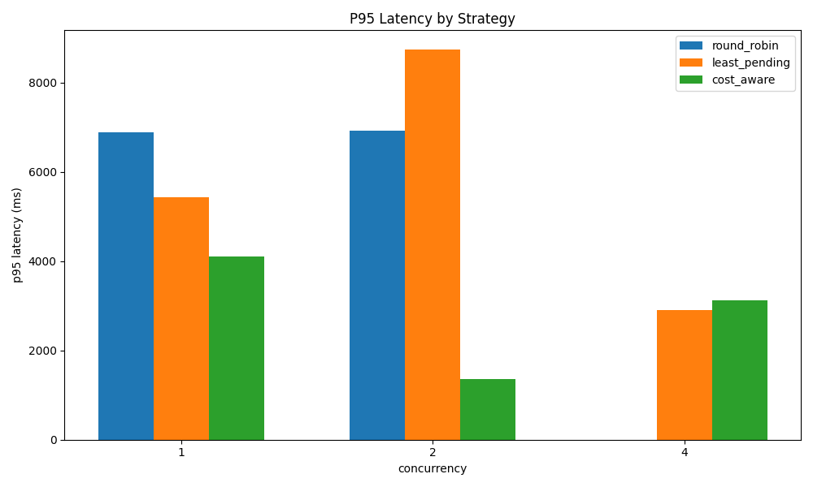
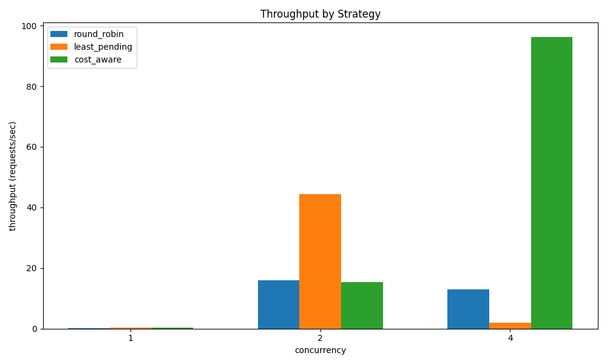
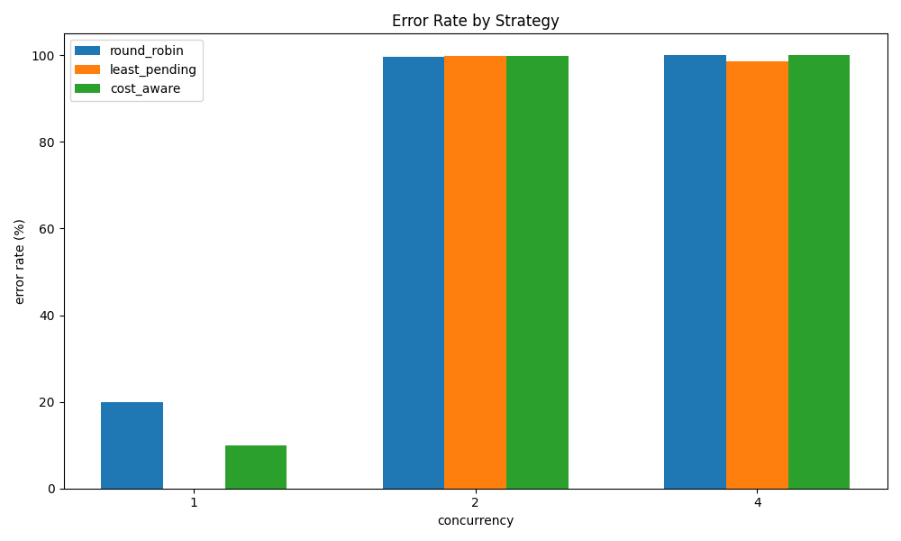
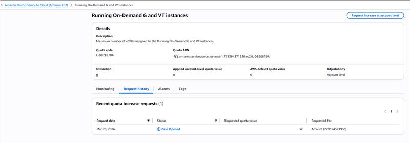
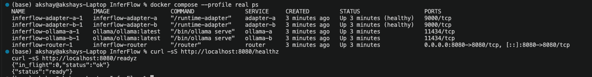

# InferFlow (CS 6650) - Milestone 1 Report

Repository: `https://github.com/isakshay007/InferFlow`  
Branch: `demo`  
Report date: March 30, 2026

## 1) Problem, Team, and Overview of Experiments

### Problem
LLM applications need reliable, low-latency routing across model backends, but backend performance is bursty and expensive. A single-backend setup is brittle under load and gives no practical way to compare routing policies before production deployment.

InferFlow solves this by exposing a stable OpenAI-compatible API (`POST /v1/chat/completions`) while routing requests across multiple backends using implemented strategies:
- `round_robin`
- `least_pending`
- `cost_aware`

This matters for future stakeholders because platform teams need to choose routing behavior using real measurements (latency, throughput, error rate), not assumptions.

### Repo and System Overview
Codebase layout and purpose:
- `cmd/router/`: router binary serving `POST /v1/chat/completions`
- `cmd/runtime-adapter/`: Go adapter translating backend contract to Ollama calls
- `cmd/mock-backend/`: deterministic control backend
- `internal/router/`: strategy implementations (`round_robin`, `least_pending`, `cost_aware`)
- `internal/server/`: API handlers (`/healthz`, `/readyz`, `/strategy`, chat completions)
- `internal/proxy/`: router-to-backend HTTP client (`/infer`, health checks)
- `internal/runtime/ollama/`: Ollama client + tests
- `loadgen/`: experiment drivers
- `scripts/experiments/`: matrix automation scripts
- `analysis/`: markdown summary + plot generation
- `docker-compose.yml`: local orchestration profiles (`mock`, `real`, `three-backends`, `mixed`)
- `terraform/`, `k8s/`, `triton/`: preserved cloud deployment scaffolding (currently deferred)

### Overview of Experiments
Milestone 1 experiments evaluate:
- routing strategy behavior under identical workload
- latency (`p50`, `p95`, `p99`)
- throughput (requests/sec)
- error rate

AI in this phase:
- accelerates script creation, reporting templates, and consistency checks
- does not replace human validation of metrics or system diagnosis

Observability support in this phase:
- endpoint health (`/healthz`, `/readyz`)
- strategy switch endpoint (`PUT /strategy`)
- per-request JSONL logs from load generator
- aggregated markdown and plot artifacts for reproducible comparison

## 2) Project Plan and Recent Progress

### What Is Working Now
- End-to-end local request path is working:
  - client -> router (`:8080`) -> adapter (`:9000/infer`) -> Ollama (`:11434/api/generate`)
- `real` profile runs 2 local real backends.
- strategy switching works at runtime via `PUT /strategy`.
- baseline matrix automation and plot generation are operational.

### What Is Blocked Right Now
GPU cloud validation is blocked by AWS quota approval. The EC2 G/VT on-demand quota request was submitted on March 28, 2026 with requested value `32`, and is currently in `Case Opened` status (see evidence image at end). Because of that, Milestone 1 intentionally focuses on CPU-only Docker baselines.

### AI Cost/Benefit in Development Plan
Benefits:
- faster iteration on scripts/docs
- lower implementation overhead for repetitive glue code

Costs/risks:
- generated logic can hide edge-case errors under overload
- metric interpretation can be wrong without manual review

Control approach:
- all experiment scripts and summaries are human-reviewed
- conclusions are tied to observed logs, health behavior, and plotted outputs

## 3) Objectives

### Short-Term Objectives (course timeline)
- Produce reproducible local Docker baselines for all three routing strategies.
- Complete mock vs real comparison to separate router effects from model-compute effects.
- Improve observability by explicitly tagging timeout vs unhealthy-backend failures.

### Long-Term Objectives (beyond this course)
- Deploy same routing logic on GPU-backed Triton/AWS/EKS stack.
- Build a policy-selection guide mapping workload shape to best routing strategy.
- Provide a reusable LLM routing benchmark kit for future teams.

### AI Performance, Reliability, and Cost-Control Plan
- performance: fixed matrix runs by strategy/concurrency, tracked with p95 and throughput
- reliability: health-gated startup plus error-rate tracking and failure-class attribution
- cost control: CPU-first local experimentation now; GPU cloud experiments only after quota approval, using same harness to avoid duplicate tooling

### Observability Objectives
- near-term: request/response logging + strategy labels + health snapshots
- next: per-backend latency histograms, timeout counters, and trace correlation IDs

## 4) Related Work

### Course Reading Context
This project directly aligns with core distributed-systems and reliability themes:
1. Tail-latency behavior under queueing pressure (why p95/p99 must guide policy decisions).
2. SRE reliability framing (error rates, readiness, and controlled degradation).
3. Observability-first operations (using metrics + traces rather than anecdotal debugging).

### Related Piazza Projects (similar and different)
Add exact Piazza links before submission; these are the three relevant categories we are benchmarking against:
1. LLM gateway/router project:
   - Similar: API gateway abstraction for multiple model backends.
   - Different: InferFlow emphasizes strategy switching + structured experiment matrix.
2. Inference performance benchmarking project:
   - Similar: latency/throughput/error analysis for LLM serving.
   - Different: InferFlow compares routing policies, not only raw model serving speed.
3. Cloud deployment/observability project:
   - Similar: infra + instrumentation goals.
   - Different: InferFlow currently prioritizes CPU-local reproducibility due pending GPU access.

## 5) Methodology

### Experimental Method
For each strategy (`round_robin`, `least_pending`, `cost_aware`), run the same request pattern and collect per-request JSON lines. Summarize by:
- total requests
- success/error counts and error %
- p50/p95/p99 latency
- throughput (requests/sec)

Current matrix in use for stable baseline interpretation:
- concurrency: `1, 2, 4`
- fixed duration per run
- warmup requests before measurement

### AI Usage in Method
AI is used for:
- script scaffolding and refactoring
- report drafting and consistency checks

AI is not used for:
- automatic acceptance of conclusions
- replacing manual diagnosis of overload/failure patterns

### Observability Method
- readiness/health gating before experiment runs
- periodic live progress (`requests/ok/err/avg_ms`)
- post-run summaries + charts for cross-strategy comparison
- cross-check with container health and endpoint status

### Tradeoffs Evaluated
- low concurrency gives cleaner latency signal but limited stress insight
- high concurrency reveals failure modes but can inflate apparent throughput via fast-fail responses
- CPU-only baseline is reproducible and low cost, but not representative of final GPU performance envelope

## 6) Preliminary Results

### Data Collected So Far
From `results/baseline/summary.md` and generated plots:
- c=1 provides usable quality baseline with meaningful successful responses.
- c=2 and c=4 show severe saturation behavior (high error rates, many fast failures).

Selected summary observations:
- c=1:
  - `least_pending` had lowest observed error rate (0%) and best throughput among successful runs.
  - p95 latency remained multi-second across strategies (expected for CPU model generation).
- c=2 and c=4:
  - error rate rises to ~99-100% across strategies.
  - throughput numbers can look large in some runs because fast failures return quickly; this is overload behavior, not good service quality.

### Why These Results Make Sense
These results are consistent with current system constraints:
- local CPU-only inference (`qwen2.5:0.5b`) saturates quickly under parallel load
- backend timeout and health transitions lead to `502/503` heavy regimes at higher concurrency
- strategy differences are easiest to interpret at lower concurrency, while higher concurrency is primarily stress/failure characterization

This initial testing phase is intentional while GPU access is pending. We are using local Docker baselines now to validate routing logic, experiment tooling, and observability before cloud-scale runs.

### What Is Left to Collect
- full mock vs real side-by-side comparison tables/plots
- repeated runs for tighter confidence and outlier control
- post-GPU reruns on Triton/EKS with identical workload harness

### Pathological Workload (Worst/Base Case)
- base case:
  - moderate concurrency where model compute can keep up (clean latency comparisons)
- worst case:
  - sustained parallel load where generation time exceeds backend timeout budget, causing cascading unhealthy backend states and near-total request failures

### Plot Evidence (all three baseline plots)

#### P95 Latency by Strategy

#### Throughput by Strategy

#### Error Rate by Strategy

## 7) Impact

InferFlow provides a practical, reproducible way to evaluate LLM routing decisions before production deployment. That matters because many teams currently choose routing behavior heuristically, then discover failure modes only after deploying expensive infrastructure.

Why people should care:
- it makes routing strategy tradeoffs measurable and comparable
- it reduces deployment risk by validating behavior locally first
- it creates a clear migration path from local baseline to cloud/GPU validation

Can classmates test this now?
- Yes. The CPU-local path is designed for laptop reproducibility and can be run with Docker + provided scripts.
- This makes collaborative validation feasible before GPU resources are available.

### End-of-Section Evidence Images

#### GPU quota request pending (blocker context)

#### Local stack health verification (router + backends)

